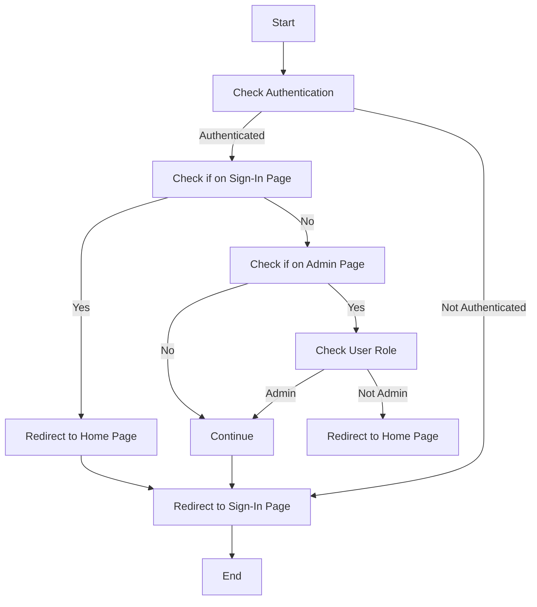

Next.js offers a powerful way to create server-rendered and statically generated web applications. One of its key features is the ability to build APIs directly within your application using API routes. However, protecting these APIs and your application's pages is crucial for data security and overall application integrity. This article will guide you through creating APIs in Next.js and implementing effective middleware for robust API protection.

# Creating APIs in Next.js

Next.js leverages a special directory structure to designate API routes. Here's how to create a basic API route:

### 1. Create the `app/api` Directory:

If it doesn't exist yet, create a directory named `api` inside your Next.js project's `app` directory. This directory serves as the root for all your API routes.

### 2. Create an API Route File:

Inside the `app/api/endpoint_name` directory, create a file named `route.ts`. This file will define the API endpoint and its behavior and it contains handlers for all the requests coming for that endpoint

### 3. Define the API Handler Function:

Export a default function from your API route file. This function will handle incoming requests and craft the response. It receives two arguments:

- `req` (NextApiRequest): An object representing the incoming HTTP request, including headers, body, and query parameters.
- `res` (NextApiResponse): An object to construct the response, allowing you to set status codes, headers, and the response body.

Here's a simple example:

```javascript
// app/api/hello/route.ts
function handler(req, res) {
  res.status(200).json({ message: "Hello from Next.js API!" });
}

export default {handler as GET, handler as POST}
```

Now, you can access this API endpoint at `http://localhost:3000/api/hello` (or the appropriate URL for your deployed application).

### Understanding API Routes

- **Server-Side Only:** API routes execute entirely on the server, making them ideal for database interactions, authentication, or other server-side logic.
- **No Impact on Client-Side Bundle:** They don't contribute to the size of your client-side bundle, ensuring a smooth user experience for your application's frontend.
- **Dynamic Routes:** You can create dynamic API routes (e.g., `app/api/[slug].js`) to handle requests with variable parts, allowing for more flexible API endpoints.

### Middleware for Robust API Protection

While API routes offer convenience, they require security measures to prevent unauthorized access and malicious attacks. Next.js embraces middleware, allowing you to intercept and modify requests and responses before they reach your API routes or pages. Here are some common middleware use cases:

- **Authentication and Authorization:** Use middleware to verify user identities and restrict access based on roles.
- **Input Validation:** Sanitize and validate request data to prevent vulnerabilities like SQL injection or cross-site scripting (XSS).
- **Rate Limiting:** Prevent abuse by limiting the number of requests allowed from a single IP address or user within a specific timeframe.
- **Error Handling:** Implement middleware to manage API errors gracefully, returning appropriate HTTP status codes and error messages.

#### Example Middleware Implementation (Authentication):

```javascript
import { getToken } from "next-auth/jwt";
import { NextRequest, NextResponse } from "next/server";

export async function middleware(req: NextRequest) {
  const isAuthenticated = await getToken({ req });

  const pathname = req.nextUrl.pathname;
  const isSignInPage = pathname === "/sign-in";
  const isAdminPage = pathname === "/admin" || pathname.startsWith("/admin/");

  if (isAuthenticated) {
    if (isAdminPage && isAuthenticated.role !== "ADMIN") {
      return NextResponse.redirect(new URL("/", req.nextUrl));
    }
  }

  if (isSignInPage && isAuthenticated) {
    return NextResponse.redirect(new URL("/", req.nextUrl));
  }

  if (!isAuthenticated && !isSignInPage) {
    return NextResponse.redirect(new URL("/sign-in", req.nextUrl));
  }
}

export const config = {
  matcher: ["/listings/:path*", "/admin/:path*", "/addroom"],
};
```



**Redirects**: It handles various redirection scenarios:

- If the user is already authenticated and tries to access the sign-in page, they are redirected to the home page.
- If the user is not authenticated and tries to access any page other than the sign-in page, they are redirected to the sign-in page.

**Authorization Check**: If the user is authenticated, it further checks if they are authorized to access admin pages (`isAdminPage`) based on their role. If the user is authenticated but not authorized to access admin pages, it redirects them to the home page (`/`).
