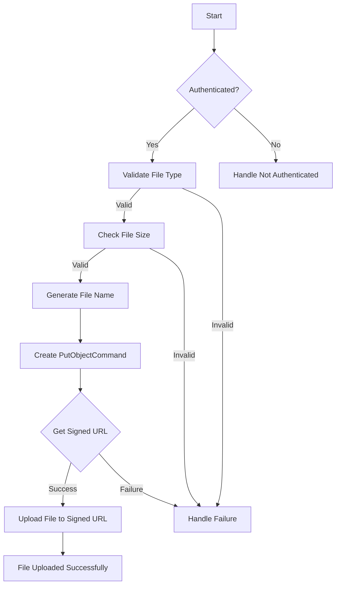

## Introduction

Amazon Simple Storage Service (S3) is like a big online storage room, similar to Google Drive or Dropbox. You can store all kinds of stuff there, like big files, documents, or pictures. It was one of the first services launched by Amazon Web Services (AWS) back in 2006.


_AWS S3 Homepage Introduction_

designed for 99.999999999% (11 9's) of durability

S3 is designed with a focus on generalized storage models. Highly advertised for highly scalable, avaliable, durable and support for other AWS services, making it ideal for microservice arcitecture for applications with very high throughput. We can build microservices that have very low latency where we can put objects and even get objects very quickly.

Useful in variety of contexts:

- website hosting
- database backup
- data processing pipelines

## Core concepts

### 1. Bucket

Buckets should have unique names. You can think of htem as general purpose file system, bucket itself is a top level folder and within it there are subfolders, different levels of folders and we can organise them depending on our use case.

### 2. Objects

Content o that we are storing in a bucket. This can include media content, json/csv/pdf files, binary files, anything. The maximum size of the bucket is 5terabytes. The objects are accessible by url like:

`http://<bucket-name>/s3.<region-name>.amazonaws.com/<object-name>`

This url only when public access is grantes, and by default the public access is not enabled.

Programatically, we can access the object in following way:

```python
s3client = boto3.client('s3')
myObject = s3client.get_object(Bucket="Bucket Name", key="Object Name")
```

## Storage Classes

initially there was only one storage class and only one prising model. Over time S3 was used used in a very wide variety of appliactions. Some applications required frequent access to data with very low latency of read and write opertions. AWS realised this problem and divied the classes based on the access paterns of the data.

S3 storage classes provide a spectrum of options, each designed for specific data access patterns and lifecycles. Here's a breakdown of the most common classes:

- S3 Standard: Ideal for frequently accessed data. It offers high performance and low latency, making it suitable for mission-critical applications and frequently downloaded files.
- S3 Intelligent-Tiering: This automated storage class analyzes access patterns and migrates data between Standard, Standard-IA, and Glacier based on usage. Perfect for data with unknown or evolving access needs.
- S3 Standard-Infrequent Access (S3 Standard-IA): Cost-effective for data accessed less often than daily. It offers a lower retrieval fee compared to S3 Standard.
- S3 One Zone-Infrequent Access (S3 One Zone-IA): Similar to S3 Standard-IA but stores data redundantly within a single Availability Zone, leading to even lower costs.
- S3 Glacier Instant Retrieval: Designed for archived data that requires occasional immediate access. It offers a balance between cost and retrieval speed.
- S3 Glacier Flexible Retrieval: Ideal for long-term data archiving where retrieval times of a few hours to a day are acceptable. Provides the lowest storage cost.
- S3 Glacier Deep Archive: The most cost-effective option for long-term, rarely accessed data retrievable in hours.

Each tire has differnet prising, latency and avaliablity

When we originally upload the data in s3, we need more frequent class. When the data is frech we are more likely going to access the data more frequently. During this period the data will be in the Standard tier. After a month or 2, the access to the data is less frequent. As the time passes we can send the data to the glacier where the data is very less frequently accessd, this way we can save costs on storage.

Standard Tier -> Infrequent Access -> Glacier/Deep Glacier

That will be a tradeoff for cost and latency. We can automate this data moment process using the lifecycle rules in the s3.

## Security

[here](https://github.com/nagwww/s3-leaks/blob/master/README.md) is a list of some news headlines of S3 AWS leaks

Security in S3 is very imoprtant to it is adviced to configure the bucket properly. **Settings in the S3 bucket really do matter**. If we are not careful, we can expost the S3 data to the public and data breaches like these can happen.

1. Public access is blocked by default
1. Data protection: Highly durable and avaliable. Data encription in transit and rest
1. Access: Access and resource based ntrols with AWS IAM
1. Audition: Access logs, action based logs, alarms
1. Infrastructure sccurity: Built on top of AWS cloud infrastructure

## Using S3 in client applications

Integrating an S3 bucket into a Next.js application typically involves allowing the application to interact with the S3 bucket for operations such as uploading files, downloading files, or accessing files stored in the bucket. One of the most important things to consider when integrating an S3 bucket into a Next.js application is ensuring secure access to the bucket while maintaining proper permissions and authentication.

We will use `S3Client` and `PutObjectCommand` from `@aws-sdk/client-s3` to put objects in our bucket.

```typescript
const s3 = new S3Client({
  region: EnvironmentVariables.webassemblybucketregion,
  credentials: {
    accessKeyId: EnvironmentVariables.bucketaccesskey,
    secretAccessKey: EnvironmentVariables.bucketsecretkey,
  },
});
```

The `getSignedUrl` function is a method provided by the AWS SDK that generates a pre-signed URL for accessing objects in an S3 bucket. This pre-signed URL contains authentication information and can be used to grant temporary access to specific objects in the S3 bucket without requiring the requester to have AWS credentials.

```typescript
import { getSignedUrl } from "@aws-sdk/s3-request-presigner";

export async function GetSignedUrl(
  type: string,
  size: number,
  checksum: string
) {
  const session = getAuthSession();

  if (!session) {
    return { failure: "Not authenticated" };
  }

  if (!acceptedFileTypes.includes(type)) {
    return { failure: "invalid Type" };
  }

  if (size > maxFileSize) {
    return { failure: "File too big" };
  }

  const fileName = generateFileName();

  const putobj = new PutObjectCommand({
    Bucket: EnvironmentVariables.webassemblybucketname,
    Key: fileName,
    ContentType: type,
    ContentLength: size,
    ChecksumSHA256: checksum,
  });

  const signedurl = await getSignedUrl(s3, putobj, {
    expiresIn: 30,
  });

  return { succes: { url: signedurl } };
}
```

Usage

```typescript
const handleSubmit = async (e: React.FormEvent<HTMLFormElement>) => {
  e.preventDefault();

  try {
    if (file) {
      //Declared in react usestate
      const signedURL = await GetSignedUrl(
        file.type,
        file.size,
        await computeSHA256(file)
      );

      if (signedURL.failure != null) {
        throw new Error(signedURL.failure);
      }

      const url = signedURL.succes?.url;

      await fetch(url, {
        method: "PUT",
        body: file,
        headers: {
          "content-type": file.type,
        },
      });
    }
  } catch (e) {
    console.log("Failed to upload file: " + e);
  } finally {
    console.log("File uploaded successfully");
  }
};
```


