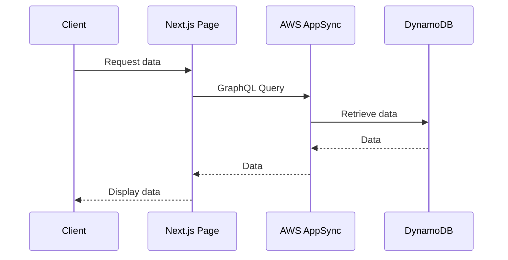

<blockquote class="twitter-tweet"><p lang="en" dir="ltr">aws documentation is really hard to understand. i can&#39;t seem to find a starting point anywhere. no way to search for solutions, no tutorials that don&#39;t take me back to some sort of &quot;hello world&quot; lambda example.</p>&mdash; Aditya (@adityagodse381) <a href="https://twitter.com/adityagodse381/status/1777713316611109194?ref_src=twsrc%5Etfw">April 9, 2024</a></blockquote> <script async src="https://platform.twitter.com/widgets.js" charset="utf-8"></script>

## Getting started

Initially, I had a hard time, figuring my way around the AWS tool and services. The documentation was really hard for me to understand. I had to take really deep to find a solution for a problem. I would search through the AWS community forums, stack overflow, reddit, median Searching for solution. I will create a series of articles with basic configuration and set ups of AWS tools and services. I am aware, Current come well soon, be outdated, so this series will be for `next js version 14` with app router.

Before getting started, [here](https://docs.aws.amazon.com/appsync/latest/devguide/quickstart.html) is the official developer guide for AppSync by AWS

## AppSync

Graph QL is an amazing technology. I am amazed by the story behind it. Checkout this documentry.

<iframe width="560" height="315" src="https://www.youtube.com/embed/783ccP__No8?si=Tzca1WZ9g2pfAxbu" title="YouTube video player" frameborder="0" allow="accelerometer; autoplay; clipboard-write; encrypted-media; gyroscope; picture-in-picture; web-share" referrerpolicy="strict-origin-when-cross-origin" allowfullscreen></iframe>

> AWS AppSync enables developers to connect their applications and services to data and events with secure, serverless and high-performing GraphQL and Pub/Sub APIs. You can do the following with AWS AppSync:

> - Access data from one or more data sources from a single GraphQL API endpoint.
> - Combine multiple source GraphQL APIs into a single, merged GraphQL API.
> - Publish real-time data updates to your applications.
> - Leverage built-in security, monitoring, logging, and tracing, with optional caching for low latency.
> - Only pay for API requests and any real-time messages that are delivered.

GraphQL is basically a query language for APIs

You can use the AWS AppSync console to configure and launch a GraphQL API. GraphQL APIs generally require three components:

**GraphQL schema** - Your GraphQL schema is the blueprint of the API. It defines the types and fields that you can request when an operation is executed. To populate the schema with data, you must connect data sources to the GraphQL API. In this quickstart guide, we'll be creating a schema using a predefined model.

**Data sources** - These are the resources that contain the data for populating your GraphQL API. This can be a DynamoDB table, Lambda function, etc. AWS AppSync supports a multitude of data sources to build robust and scalable GraphQL APIs. Data sources are linked to fields in the schema. Whenever a request is performed on a field, the data from the source populates the field. This mechanism is controlled by the resolver. In this quickstart guide, we'll be creating a data source using a predefined model alongside the schema.

**Resolvers** - Resolvers are responsible for linking the schema field to the data source. They retrieve the data from the source, then return the result based on what was defined by the field. AWS AppSync supports both JavaScript and VTL for writing resolvers for your GraphQL APIs. In this quickstart guide, the resolvers will be automatically generated based on the schema and the data source. We won't be delving into this in this section.

AWS AppSync supports the creation and configuration of all GraphQL components. When you open the console, you can use the following methods to create your API:

1. Designing a customized GraphQL API by generating it through a predefined model and setting up a new DynamoDB table (data source) to support it.
1. Designing a GraphQL API with a blank schema and no data sources or resolvers.
1. Using a DynamoDB table to import data and generate your schema's types and fields.
1. Using AWS AppSync's WebSocket capabilities and Pub/Sub architecture to develop real-time APIs.
1. Using existing GraphQL APIs (source APIs) to link to a Merged API.

## AppSync and Next.js 14

To create a graphql endpoint, you will first need Amplify cli.

`npm install -g @aws-amplify/cli`

In your current working directiory run:

`amplify init`

follow the further instructructions and you will have a _amplify_ directory

To create an graphQL api, run
`amplify add api`

```
? Please select from one of the below mentioned services:
  > GraphQL
? Here is the GraphQL API that we will create. Select a setting to edit or continue:
  > Continue
? Choose a schema template:
  > Single object with fields (e.g., “Todo” with ID, name, description)
? Do you want to edit the schema now?
  > Yes
```

The CLI should open this GraphQL schema in your text editor.

_amplify/backend/api/myapi/schema.graphql_

```graphql
type Todo @model {
  id: ID!
  name: String!
  description: String
}
```

Next step, deploy the endpoint using
`amplify push`

At this step, you are asked following questions:

```
? Are you sure you want to continue? Y

? Do you want to generate code for your newly created GraphQL API? Y
? Choose the code generation language target: javascript (or your preferred language target)
? Enter the file name pattern of graphql queries, mutations and subscriptions src/graphql/**/*.js
? Do you want to generate/update all possible GraphQL operations - queries, mutations and subscriptions? Y
? Enter maximum statement depth [increase from default if your schema is deeply nested]: 2
```

If you are using `src` directory in your project, the QraphQL queries, mutations and subscriptions will be stored in it, else you can customise the file name patterns for these. I like to keep it default in `src` folder.

The src folder also contains the `amplifyconfiguration.json` and `aws-exports.js` files, which are importnt and I will talk more about them further.

## Configure your application

To use the graphql, use this:

```typescript
import { Amplify, API, graphqlOperation } from "aws-amplify";
import awsconfig from "./aws-exports";
Amplify.configure(awsconfig);
```

### App Router

We want to use one of our server components to connect to our AWS AppSync API and list out some data.

Let’s begin by creating a new utility file that will have the serverClient function that we can use to talk to our Amplify APIs on the server side.

_utils/server-utils.ts_

```typescript
import { cookies } from "next/headers";
import { generateServerClientUsingCookies } from "@aws-amplify/adapter-nextjs/api";

import config from "../../amplifyconfiguration.json";

export const serverClient = generateServerClientUsingCookies({
  config,
  cookies,
});
```

The generateServerClientUsingCookies function generates an API that can be used with Next.js server components with dynamic rendering. This creates a secure way to access Amplify APIs on the server side. The serverclient is exported so it can be used as a utility function to call our API. In our page.tsx file we will import this function and use it to list some data for our to do app.

_page.tsx_

```typescript
import { serverClient } from "@/utils/server-utils";
import * as query from "@/graphql/queries";

export default async function Home() {
  const { data, errors } = await serverClient.graphql({
    query: query.listTodos,
  });

  if(errors){
   // handle errors
  }

return (
    <div>
      {data.listTodos.items.map((post) => {
        return (
          <li key={post.id}>
            <div>Name: {post.name}</div>
            <span>Description: {post.description}</span>
          </li>
        );
      })}
    </div>
  );
```

## Middleware

Amplify also now supports middleware in Next.js. You can use the `runWithAmplifyServerContext` inside middleware to work with Amplify APIs.

Let’s build an app where you want to redirect to the login route any time a user is not authenticated. Here is an example using the app router. First, we’ll create a new server-utils file in the utils folder:

_utils/server-utils.ts_

```typescript
import { createServerRunner } from "@aws-amplify/adapter-nextjs";
import config from "../../amplifyconfiguration.json";

export const { runWithAmplifyServerContext } = createServerRunner({
  config,
});
```

This will create the `runWithAmplifyServerContext` that we’ll be using in our middleware below.

```typescript
import { runWithAmplifyServerContext } from "@/utils/server-utils";

// The fetchAuthSession is pulled as the server version from aws-amplify/auth/server
import { fetchAuthSession } from "aws-amplify/auth/server";
import { NextRequest, NextResponse } from "next/server";

export async function middleware(request: NextRequest) {
  const response = NextResponse.next();

  const pathname = req.nextUrl.pathname;
  const isSignInPage = pathname === "/sign-in";
  const isAdminPage = pathname === "/admin" || pathname.startsWith("/admin/");

  // The runWithAmplifyServerContext will run the operation below
  // in an isolated matter.
  const authenticated = await runWithAmplifyServerContext({
    nextServerContext: { request, response },
    operation: async (contextSpec) => {
      try {
        // The fetch will grab the session cookies
        const session = await fetchAuthSession(contextSpec, {});
        return session.tokens !== undefined;
      } catch (error) {
        console.log(error);
        return false;
      }
    },
  });

  // If user is authenticated then the route request will continue on
  if (authenticated) {
    if (isAdminPage && authenticated.role !== "ADMIN") {
      return NextResponse.redirect(new URL("/", req.nextUrl));
    } else {
      return response;
    }
  }

  if (isSignInPage && authenticated) {
    return NextResponse.redirect(new URL("/", req.nextUrl));
  }

  if (!authenticated && !isSignInPage) {
    return NextResponse.redirect(new URL("/sign-in", req.nextUrl));
  }
}

// This config will match all routes accept /login, /api, _next/static, /_next/image
// favicon.ico
export const config = {
  matcher: [
    /*
     * Match all request paths except for the ones starting with:
     * - api (API routes)
     * - _next/static (static files)
     * - _next/image (image optimization files)
     * - favicon.ico (favicon file)
     */
    "/((?!api|_next/static|_next/image|favicon.ico|login).*)",
  ],
};
```


