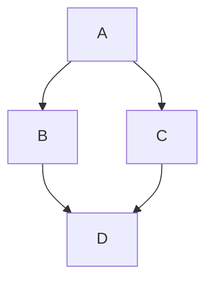
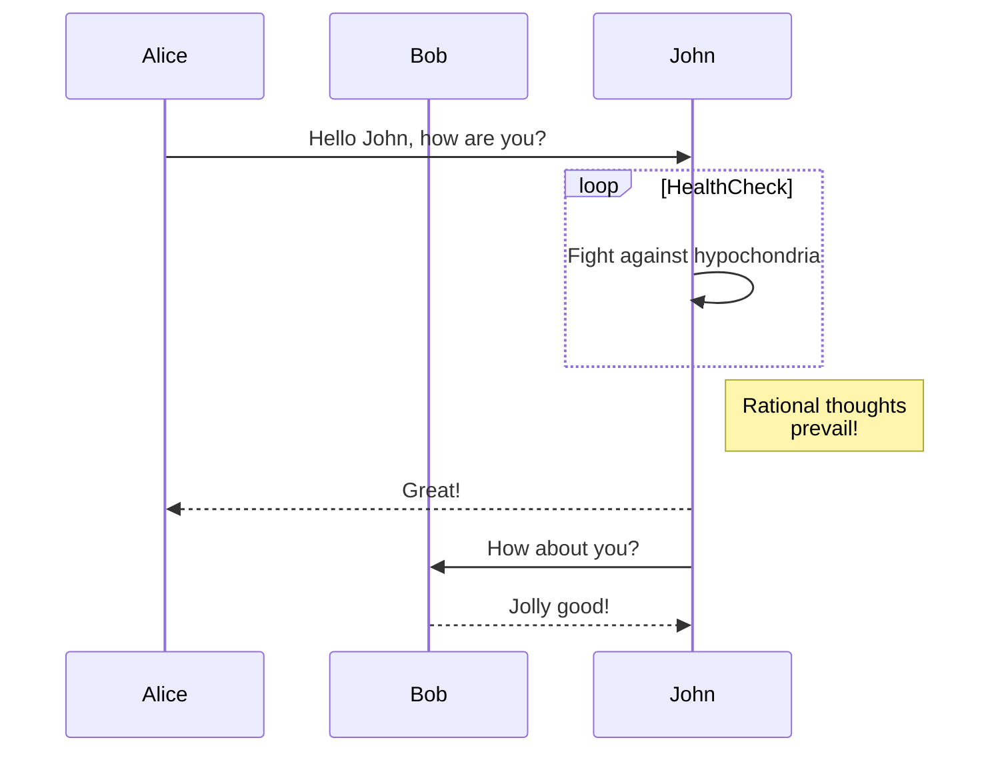
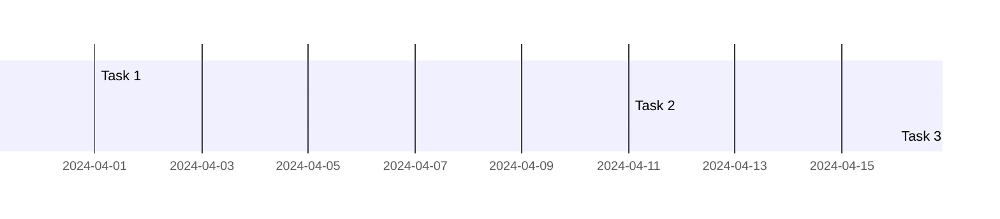
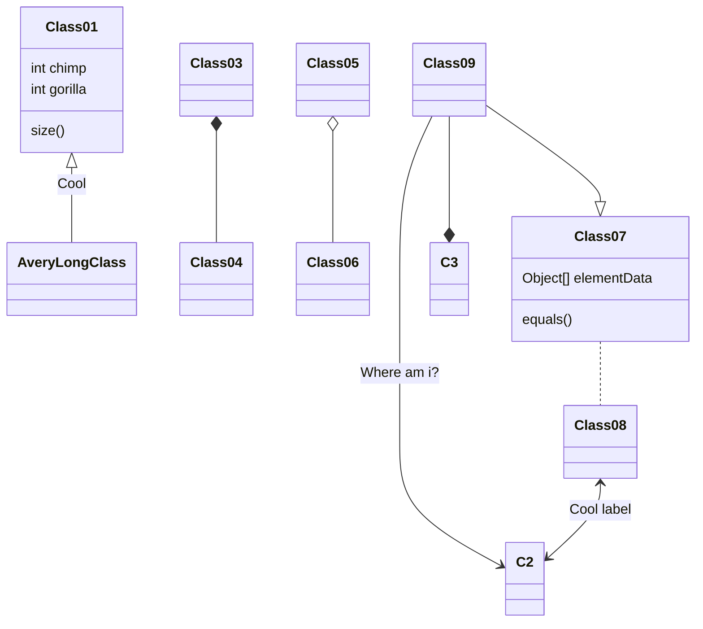
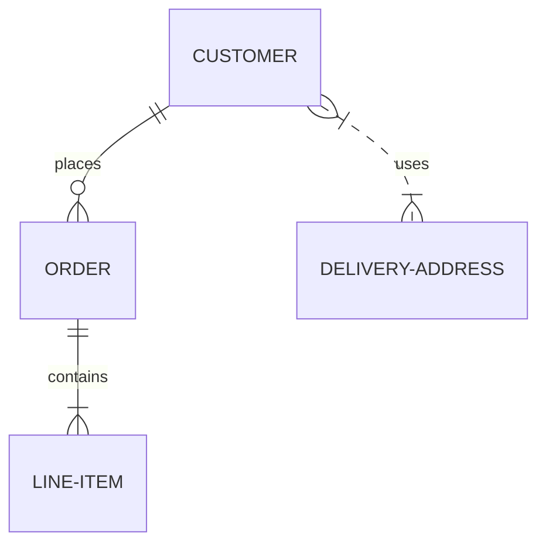
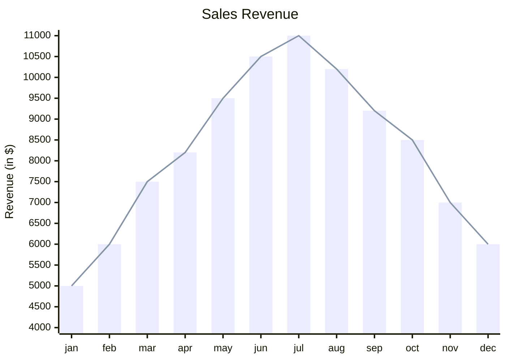

I think it was after people started using [Claud AI](https://claude.ai/) that `mermaid JS` became popular. People asked it to create charts, and it provided markdown text outputs compatible with [mermaid js](https://mermaid-js.github.io/mermaid/) for those flow charts. Some months back, I found a GitHub project—a movie recommendation system—that utilized Claude. It takes our favorite things and gives recommendations through a flow chart. You can find the GitHub repository [here](https://github.com/sankalp1999/Handpicked-by-Haiku-for-You).

Checkout the project at [handpicked-by-haiku-for-you.onrender.com](https://handpicked-by-haiku-for-you.onrender.com/)


_handpicked by haiku for you website preview_

Mermaid is a cool tool for making visual charts and diagrams. Now, even GitHub markdown supports it. With mermaid, you can draw all sorts of things.

### 1. [Flowchart](https://mermaid.js.org/syntax/flowchart.html?id=flowcharts-basic-syntax)

```
graph TD;
    A-->B;
    A-->C;
    B-->D;
    C-->D;
```



### 2. [Sequence Diagram](https://mermaid.js.org/syntax/sequenceDiagram.html)

```
sequenceDiagram
    participant Alice
    participant Bob
    Alice->>John: Hello John, how are you?
    loop HealthCheck
        John->>John: Fight against hypochondria
    end
    Note right of John: Rational thoughts <br/>prevail!
    John-->>Alice: Great!
    John->>Bob: How about you?
    Bob-->>John: Jolly good!
```



### 3. [Gantt diagram](https://mermaid.js.org/syntax/gantt.html)

```
gantt
  Task 1: 2024-04-01, 2024-04-10
  Task 2: 2024-04-11, 2024-04-15 (critical)
  Task 3: 2024-04-16, 2024-04-20
```



### 4. [Class diagram](https://mermaid.js.org/syntax/classDiagram.html)

```
classDiagram
Class01 <|-- AveryLongClass : Cool
Class03 *-- Class04
Class05 o-- Class06
Class07 .. Class08
Class09 --> C2 : Where am i?
Class09 --* C3
Class09 --|> Class07
Class07 : equals()
Class07 : Object[] elementData
Class01 : size()
Class01 : int chimp
Class01 : int gorilla
Class08 <--> C2: Cool label
```



### 5. [Entity Relationship Diagram](https://mermaid.js.org/syntax/entityRelationshipDiagram.html)

```
erDiagram
    CUSTOMER ||--o{ ORDER : places
    ORDER ||--|{ LINE-ITEM : contains
    CUSTOMER }|..|{ DELIVERY-ADDRESS : uses

```



### 6. [Quadrant Chart](https://mermaid.js.org/syntax/quadrantChart.html)

```
erDiagram
    CUSTOMER ||--o{ ORDER : places
    ORDER ||--|{ LINE-ITEM : contains
    CUSTOMER }|..|{ DELIVERY-ADDRESS : uses

```


### 6. [XY Chart](https://mermaid.js.org/syntax/xyChart.html)

```
xychart-beta
    title "Sales Revenue"
    x-axis [jan, feb, mar, apr, may, jun, jul, aug, sep, oct, nov, dec]
    y-axis "Revenue (in $)" 4000 --> 11000
    bar [5000, 6000, 7500, 8200, 9500, 10500, 11000, 10200, 9200, 8500, 7000, 6000]
    line [5000, 6000, 7500, 8200, 9500, 10500, 11000, 10200, 9200, 8500, 7000, 6000]
```



## Usage

Mermaid is a powerful tool and can simplify a lot of visualisation stuff. We can add diagrams in our readme without having to use any external image files. We can even export the images.

The community support is also pretty good around mermaid and there are pretty good online mermaid js editors online, visual and text based.

we can install the mermaid using node package manager:

- ```bash
  npm i mermaid
  ```
- ```bash
  yarn i mermaid
  ```
- ```bash
  pnpm i mermaid
  ```

## Mermaid APi

To deploy mermaid without a bundler, insert a script tag with an absolute address and a mermaid.initialize call into the HTML using the following example:

```html
<script type="module">
  import mermaid from "https://cdn.jsdelivr.net/npm/mermaid@10/dist/mermaid.esm.min.mjs";
  mermaid.initialize({ startOnLoad: true });
</script>
```

Doing so commands the mermaid parser to look for the `<div>` or `<pre>` tags with `class="mermaid"`. From these tags, mermaid tries to read the diagram/chart definitions and render them into SVG charts.

## Note by Knut Sveidqvist, creator of Mermaid

Mermaid was created by [Knut Sveidqvist](https://github.com/knsv)

> Things are piling up and I have a hard time keeping up. It would be great if we could form a core team of developers to cooperate with the future development of mermaid. As part of this team you would get write access to the repository and would represent the project when answering questions and issues. Together we could continue the work with things like:
>
> - Adding more types of diagrams like mindmaps, ert diagrams, etc.
> - Improving existing diagrams
>   Don't hesitate to contact me if you want to get involved!

_Mermaid was created by Knut Sveidqvist for easier documentation._
