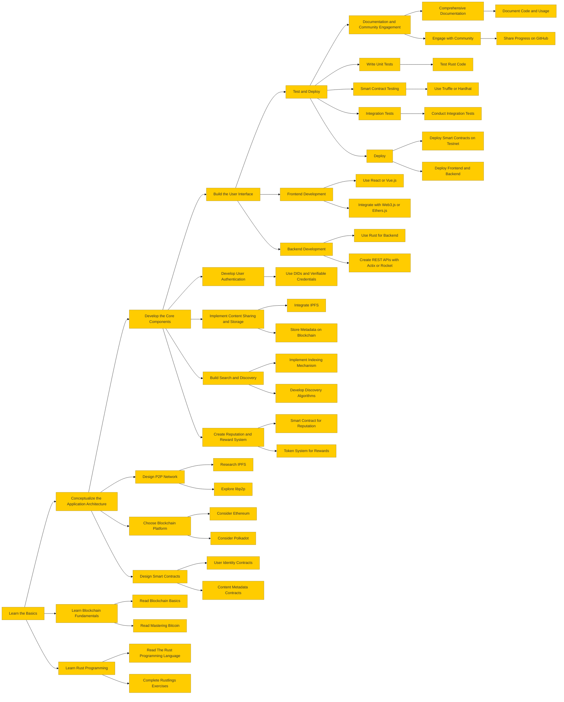

i want to learn blockchain. previously i've build a [torrent client](https://github.com/adimail/torrent-client) using golang that [bencodes](https://en.wikipedia.org/wiki/Bencode) _.torrent_ files to download the assets using bit torrent protocol. it was from a tutorial from [build-your-own-x](https://build-your-own-x.vercel.app/) project. It was really fun. the first time i downloaded the debian os file, it was a really inspiring moment for me. to watch all the pieces of the go code working together, it was so beautiful.

_here is a demo of me downloading a debian distro from a .torrent file using bit torrent protocal_

## the idea

an application that will allow users (students) to share study materials, notes, computer programs, codes, reports and other relevant materials with each other over a decentralized network. along thw way, i will also learn rust and web3.

i am also thinking about users can upload, download, and review materials, earning native tokens as rewards for their contributions. i would also need a search engine and a recommendation system.

people can:

- share study material
  - pdf
  - computer programs
  - text files
  - notes
  - screenshots/images
- download material
- search through the content
- stay anonymous
- earning rewards for their contributions

_client-server vs p2p_

### decentralized architecture

decentralized architecture refers to a system design where there is no single central authority or server controlling the entire network. Instead, control and data are distributed across multiple nodes (computers) in the network.

- resilience and stability
- reduced censorship
- scalability
- security and privacy

### p2p

p2p architecture is a subset of decentralized architecture where each node in the network can act as both a client and a server. In a P2P network, nodes (peers) communicate directly with each other, sharing resources and information without needing a central server. Here are the key features and advantages

- resource sharing
- direct communication

blockchain, DAOs and dApps are good examples of decentralized networks. i once interviewed a student from pune for a backend role in our startup, he was good. his expertise was in dapps and blockchain. we didn't work out but his profile was good. now i will learn this as well and share the results on my blog.

## step-by-Step Plan

1. **Learn the Basics**

   - **Learn Blockchain Fundamentals**
     - Read Blockchain Basics
     - Read Mastering Bitcoin
   - **Learn Rust Programming**
     - Read The Rust Programming Language
     - Complete Rustlings Exercises

2. **Conceptualize the Application Architecture**

   - **Design P2P Network**
     - Research IPFS
     - Explore libp2p
   - **Choose Blockchain Platform**
     - Consider Ethereum
     - Consider Polkadot
   - **Design Smart Contracts**
     - User Identity Contracts
     - Content Metadata Contracts

3. **Develop the Core Components**

   - **Develop User Authentication**
     - Use DIDs and Verifiable Credentials
   - **Implement Content Sharing and Storage**
     - Integrate IPFS
     - Store Metadata on Blockchain
   - **Build Search and Discovery**
     - Implement Indexing Mechanism
     - Develop Discovery Algorithms
   - **Create Reputation and Reward System**
     - Smart Contract for Reputation
     - Token System for Rewards

4. **Build the User Interface**

   - **Frontend Development**
     - Use React or Vue.js
     - Integrate with Web3.js or Ethers.js
   - **Backend Development**
     - Use Rust for Backend
     - Create REST APIs with Actix or Rocket

5. **Test and Deploy**

   - **Write Unit Tests**
     - Test Rust Code
   - **Smart Contract Testing**
     - Use Truffle or Hardhat
   - **Integration Tests**
     - Conduct Integration Tests
   - **Deploy**
     - Deploy Smart Contracts on Testnet
     - Deploy Frontend and Backend

6. **Documentation and Community Engagement**
   - **Comprehensive Documentation**
     - Document Code and Usage
   - **Engage with Community**
     - Share Progress on GitHub

this is the first fost of manny to come of my progress with this application

i just downloaded the movie [the intern](https://letterboxd.com/film/the-intern-2015/) from torrent and am writing this article while the movie is being downloaded on my mobile.

i also have end semester exams from next tuesday (3 days to go). i also need to take time out from my startup to get this done. next thing ill do is create an wireframe for the app, then study p2p, then create a flutter boiler plate.

one might think why am i having too many things on my plate at the same time. but thats the way i am.

so much to learn, so little time 🪽
