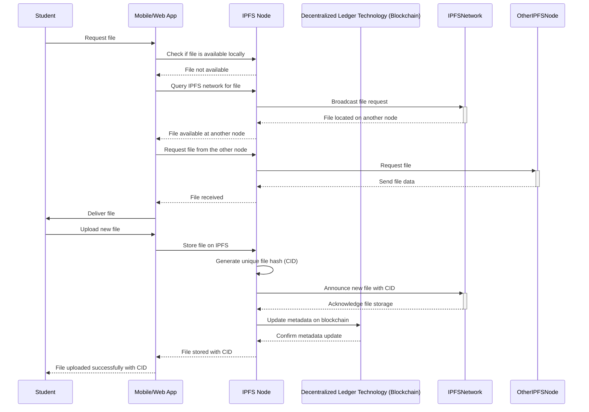
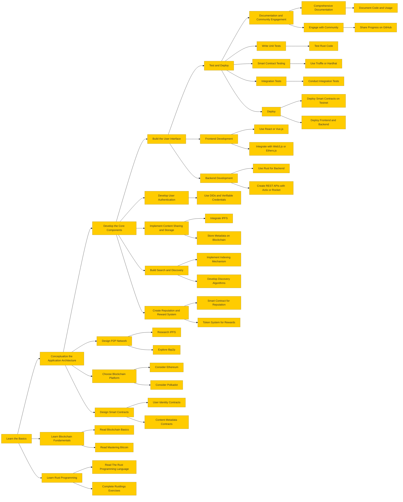

Previously i've build a [torrent client](https://github.com/adimail/torrent-client) using golang that [bencodes](https://en.wikipedia.org/wiki/Bencode) _`.torrent`_ files to download the assets using bit torrent protocol. It was from a tutorial from [build-your-own-x](https://build-your-own-x.vercel.app/) project and it was really fun. The first time I downloaded the debian os file using my torrent client, it was a really inspiring moment for me. To watch all the pieces of the go code working together, it was so beautiful.

_here is a demo of me downloading a debian distro from a .torrent file using bit torrent protocal_

## The idea

An application that will allow users (students) to share study materials, notes, computer programs, codes, reports and other relevant materials with each other over a decentralized network.

I am also thinking about users can upload, download, and review materials, earning native tokens as rewards for their contributions. i would also need a search engine and a recommendation system.

People can:

- share study material
  - pdf
  - computer programs
  - text files
  - notes
  - screenshots/images
- download material
- search through the content
- stay anonymous
- earning rewards for their contributions

_client-server vs p2p_

### Decentralized architecture

Decentralized architecture refers to a system design where there is no single central authority or server controlling the entire network. Instead, control and data are distributed across multiple nodes (computers) in the network.

- resilience and stability
- reduced censorship
- scalability
- security and privacy

### p2p

P2P architecture is a subset of decentralized architecture where each node in the network can act as both a client and a server. In a P2P network, nodes (peers) communicate directly with each other, sharing resources and information without needing a central server. Here are the key features and advantages

- resource sharing
- direct communication

Blockchain, DAOs and dApps are good examples of decentralized networks.

## How it will work

Imagine a network collectively owned by all the students, without any central server—just their mobile devices and personal computers. On this network, students can find, share, search, filter, sort, view, and transfer files among themselves. They don't need an internet connection to share files if they are on the same WiFi network, making it easy to share lecture notes, PDF files, and computer programs with one another.

IPFS (InterPlanetary File System) is a peer-to-peer distributed file system that aims to connect all computing devices with the same system of files. It is a protocol designed to create a more decentralized and efficient web by allowing users to store and share data in a distributed manner.

### 1. File Request:

- The student requests a file through the mobile app.
- The app checks if the file is available locally on
- its connected IPFS node.
- If not available, the app queries the IPFS network for the file.
- The IPFS network locates the file on another node and informs the app.
- The app requests the file from the other IPFS node.
- The file is transferred from the other IPFS node - to the app, and then to the student.

### 2. File Upload:

- The student uploads a new file via the mobile app.
- The app stores the file on the connected IPFS node.
- The IPFS node generates a unique file hash (CID) for the file.
- The IPFS node announces the new file with the CID to the IPFS network.
- The IPFS network acknowledges the file storage.
- The IPFS node updates the metadata on the decentralized ledger technology (blockchain) with the file's CID.
- The blockchain confirms the metadata update.
- The IPFS node confirms the file storage with the app.
- The app notifies the student that the file has been uploaded successfully with its CID.

## step-by-Step Plan

1. **Application Architecture**

   - **Design P2P Network**
     - Research IPFS
     - Explore libp2p
   - **Choose Blockchain Platform**
     - Consider Ethereum
     - Consider Polkadot
   - **Design Smart Contracts**
     - User Identity Contracts
     - Content Metadata Contracts

1. **Core Components**

   - **User Authentication**
     - Use DIDs and Verifiable Credentials
   - **Implement Content Sharing and Storage**
     - Integrate IPFS
     - Store Metadata on Blockchain
   - **Build Search and Discovery**
     - Implement Indexing Mechanism
     - Develop Discovery Algorithms
   - **Create Reputation and Reward System**
     - Smart Contract for Reputation
     - Token System for Rewards

1. **User Interface**

   - **Frontend Development**
     - Use React or Vue.js
     - Integrate with Web3.js or Ethers.js
   - **Backend Development**
     - Use Rust for Backend
     - Create REST APIs with Actix or Rocket

This is the first fost of manny to come of my progress with this application

I also have end semester exams from next tuesday (3 days to go). i also need to take time out from my startup to get this done. next thing i am going to do is create an wireframe for the app, then study p2p, then create a flutter boiler plate.

One might think why am i having too many things on my plate at the same time. but thats the way i am.

So much to learn, so little time 🪽
