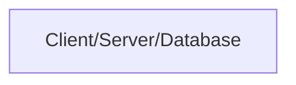
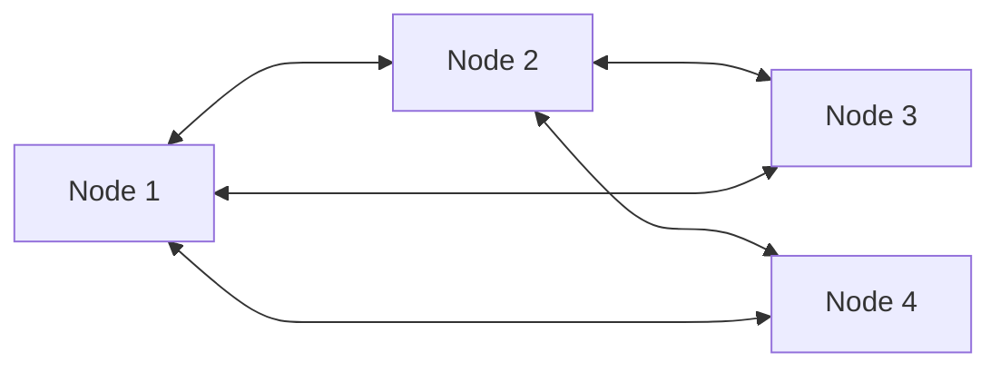
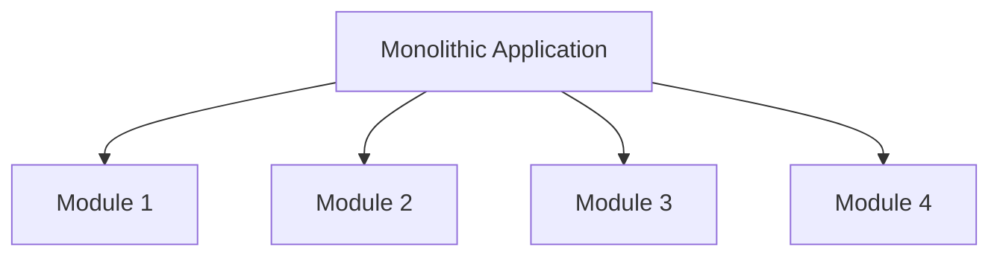
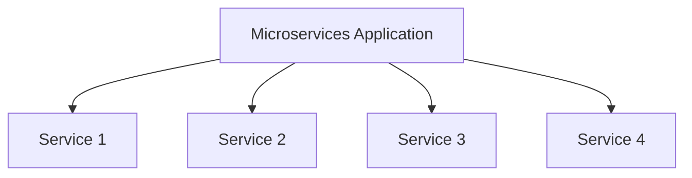
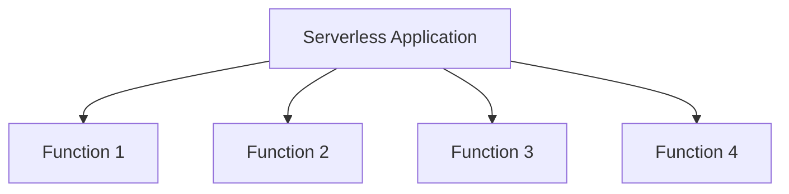
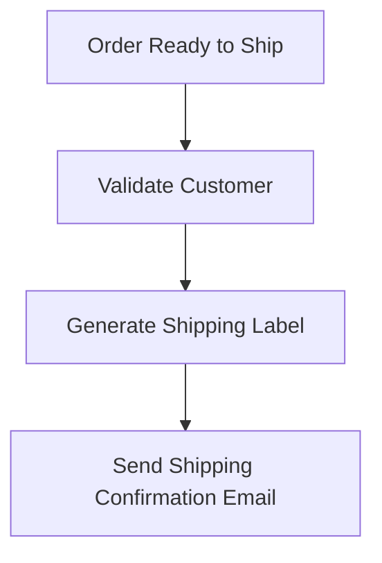

The first ever application any developer builds unknowingly implements the [monolithic architecture](https://microservices.io/patterns/monolithic.html), all code sits into a single repo/code-base tightly coupled together.

But when we want to scale to more users, we can use a [microservice architecture](https://microservices.io/).

But there is lot more to consider in terms of architecture.

- how many tiers is the application
- where does each component live, all on the same
  server or each have their own server
- are you going with a server-less architecture
- if you're on web 2 you're probably doing client
  server but if you're on web3 then you're doing peer-to-peer

## What is Web App Architecture

the web app architecture of a system describes its major components their relationships and how they interact with each other it essentially serves as a blueprint the layout of it all and there are two main ways in which it's laid out at least in the overarching more broad idea of architecture with the main one being client server architecture

## Client-Server Architecture

Let's take the web app. We typically have the client side (or front-end), the server side (or back-end), the database, and everything in between. Not all web applications are set up just like this, where you have the client side, the server side (which is the business logic in this case), and then the database all living on their own physical machines. This is where different tiers in software architecture come into play.

### One-Tier Architecture

A one-tier application will have all of this on a single machine.

### Two-Tier Architecture

A two-tier application can be split one of two ways:

With the client side and server side business logic living on one machine and the database living on a second machine.
With the client side living on one machine and the server side business logic and database living on the second machine.

### Three-Tier Architecture

What you're looking at now is three-tier with each individual section being in its own machine.

## peer-to-peer architecture

There are a small percentage of businesses that use this, and I'll give you some examples, but something that you can really wrap your head around is Web 3 and blockchain. Peer-to-peer architecture is the base of blockchain technology. It is a network of computers, also known as nodes, that are able to communicate with each other without the need for a central server like that of client-server architecture.

## next level of architecture

### Monolithic Architecture

In a monolithic architecture, all the modules are coded in a single codebase, tightly coupled together. This is unlike the microservices architecture, where every distinct feature of an application may have one or more dedicated microservices powering it. This is how basically everything used to be built because it's simple and fast. You can easily deploy it.

However, there are a lot more negatives than there are positives because it's not scalable or reliable, and there are single points of failure. To put it in perspective, every single time you add a single line of code, you would have to redeploy the entire application. And not only do you have to redeploy it, but if something breaks, it breaks the entire application.

### Microservices Architecture

The answer to all of those problems is solved with microservice architecture. This is where you have a collection of services that each serve a unique responsibility. Every single service is deployed and lives separately from one another. To complete the business logic, they can connect to each other as needed. In simpler terms, it's modular.

## serverless architecture

Also known as serverless service, serverless computing, or function as a service, it's a software design pattern where our function (which is a part of the microservices responsibility) is hosted by a third party. This is your AWS Lambda functions, your Azure functions, and your Firebase cloud functions.

To explain this further, let's use an online shopping example. You have a product catalog, a checkout system, and a shipping process. In a monolithic application, all of those are built and deployed as one holistic unit. In a microservice application, each individual component is broken down into its own service. A benefit here is that each individual microservice can have its own language, its own libraries, and typically its own database.

In a serverless application, we're talking about serverless microservices. We break the microservices down even smaller into their own individual event-driven functions. For example, the shipping microservice will have multiple functions within it. Once an order is marked as ready to ship, that event could trigger a function that validates the customer. A successful validation could trigger another function that generates a shipping label. Finally, the creation of that shipping label could trigger a final function that sends a shipping confirmation email to the customer. These are built with serverless functions which execute small blocks of code with one bucket of code triggering the next.

## No code

No thanks. I will code

here is the summary:

- lock in
- performance
- technical debt
- difficult to reuse
- goes to shit the moment you try to do anything outside their "intended use case"
- flexibility
- ethics (i mean, you as a software developer, why would you ever consider no code)

In practice, sooner or later when you try to do something too specific/custom and complex, you'll be forced to see what's under the hood and actually write code. I will not trade abstraction for expressiveness. Low code is the high-interest credit card of technical debt.
