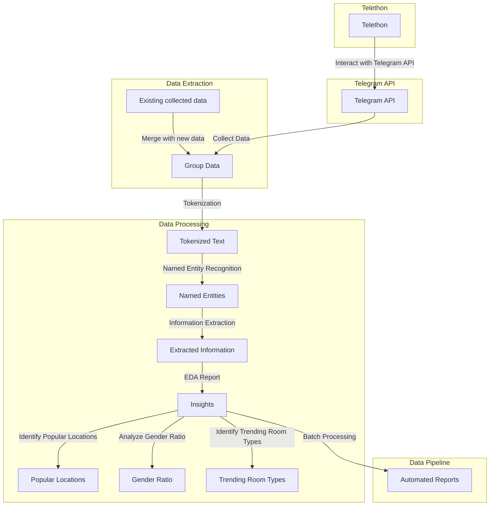

There is a telegram group where people living in pune can add their room listings to find rooms/roomates/tenants for them. My task is to scrape the data from that channel and create an EDA report on this data in order to get some insights to support some buisness objectives.

## Background

I hardly think that channel is useful becuase there are around 100-150 listings added on the daily basis, completly unstructured data. Plus, the channel owner takes charges of 100₹/listing to advertise on the channel. Most of the listings are lost because of the velocity at which new listings are added.

## Objectives

- Create a scrapping bot to extract data from group
- Extract specific information(room type, location, et al) using NLP techniques
- perform EDA report for popular locations, gender ratio for rooms, etc.
- Automate the task of generating the reports by building a [data pipeline](https://www.ibm.com/topics/data-pipeline) for batch processing


_Data Pipeline_

## Challanges while reading this data

- Message content is unstructured
- Text contains noise, irrelevant information, and non-standard formats.
- Messages are in multiple languages (English, marathi, hindi)
- Identifying and extracting specific entities (e.g., mobile numbers, areas, rent, deposit, gender) from free-form text.
- Variability in how information is expressed (e.g., different terms for rent, deposit, gender, and areas).
- Some advertisements may lack certain details (e.g., missing rent or deposit information).
- Understanding the context in which certain terms are used (e.g., distinguishing between "rent" and "deposit" amounts).
- Identifying and standardizing area names, especially when they are mentioned in various formats or misspelled (use fuzzy matching techniques)

## 4 July 2024

The first thing I did is searched 'telegram web scrapping' on google. I found out that telegram provides a bot API that allows developers to create and manage Telegram bots, which can interact with users, send and receive messages, and perform various automated tasks.

In our specific context, telegram API can be useful to extract the information from the group which includes files, and metadata from for analysis.

## 5 July 2024: Morning

I built a simple scrapper that can collect data from telegram channel using [telethon](https://docs.telethon.dev/en/stable/), a python library to interact with telegram bot API. You can generate the credentials from the [API development tools](https://my.telegram.org/auth) section on their website.

After creating an application on the developer account, you will recieve credentials for `app_id` and `api_hash` which we can use with client side tools like _telethon_ to interact with their data.

**While using the telegram bots, remember not to break the terms and conditions else there are chances for your account to be _banned_ from their platform**

Here is the sample code for using the from telethon documentation that uses `TelegramClient` to send a message to self:

```python
from telethon.sync import TelegramClient, events

with TelegramClient('name', api_id, api_hash) as client:
   client.send_message('me', 'Hello, myself!')
   print(client.download_profile_photo('me'))

   @client.on(events.NewMessage(pattern='(?i).*Hello'))
   async def handler(event):
      await event.reply('Hey!')

   client.run_until_disconnected()
```

At the time of writing this blog, I am using the telethon version `1.35.0`.

### Our goals

- Collect messages from channel with their timestamps in free-form text
- Extract specific entities (e.g., mobile numbers, areas, rent, deposit, gender) from free-form text.
- VIsualise data for data analysis

To scrape the data, first we will create a client

```python
client = TelegramClient('bot', api_id, api_hash)
```

Then we can get the channel using

```python
channel = await client.get_entity(channel_username)
```

then we can get the messages

```python
messages = await client.get_messages(channel, limit=100, offset_id=0)
```

using a for loop, we can read the message text content and date

```python
for message in messages:
    if message.text:
        all_messages.append((message.date, message.text))
```

### Code

Find the complete code on my [git repo](https://github.com/adimail/telegram-scrapper) along with isntructions to run the code on your local machine.

### Important

Note that Telethon is an asynchronous library, and as such, you should get used to it and learn a bit of basic asyncio. This will help a lot. As a quick start, this means you generally want to write all your code inside some async def like so:

```python
client = ...

async def do_something(me):
    ...

async def main():
    # Most of your code should go here.
    # You can of course make and use your own async def (do_something).
    # They only need to be async if they need to await things.
    me = await client.get_me()
    await do_something(me)

with client:
    client.loop.run_until_complete(main())
```

After you understand this, you may use the telethon.sync hack if you want do so (see Compatibility and Convenience), but note you may run into other issues (iPython, Anaconda, etc. have some issues with it).

## 5 July 2024: Evening

Okay, so now we have raw data to work with. Next task is to extract specific entities.


To extract the required information from this type of raw unstructured data, we can use Natural Language Processing (NLP) techniques.

Libraries like re (Regular Expressions) and nltk (Natural Language Toolkit) can be used to work with text data for keyword search techniques like fuzzy search. Using these is essential because we cannod do simple

```python
str.contains(DESIERED_KEYWORD)
```

because people makes spelling mistakes and there is a lot of ambiguity in words. for eg

- _karve nagar_ can be written as _karvenagar_
- _boy_ and _boys_ are 2 different words for python strings
- 1bhk, 1 bhk, 1BHK are different strings for python as well

#### nltk and re

so we can use `re` to identify patterns like:

```python
room_type_pattern = re.compile(r'\b(1 rk|1rk|1bhk|1 bhk|2bhk|2 bhk|3bhk|3 bhk|flat|hostel)\b', re.IGNORECASE)

def extract_room_type(text):
    return re.findall(room_type_pattern, text)
```

We can use `nltk.tokenize.word_tokenize` to tokenize the text before applying the regex patterns.

```python
df['tokens'] = df['content'].apply(tokenize_text)
```

The tokenized text is then stored in a new column called 'tokens' in the DataFrame. All subsequent extraction functions operate on this tokenized text column.

## Example

To extract mobile numbers from the messages, we can use `re` in following way:

```python
mobile_pattern = re.compile(r'\+91\d{10}')

def extract_mobile(text):
    return re.findall(mobile_pattern, text)

def tokenize_text(text):
    return word_tokenize(text)

df['tokens'] = df['content'].apply(tokenize_text)
df['mobile_numbers'] = df['content'].apply(extract_mobile)
```

This way we can extract categories from raw data.



## Next steps

- perform one hot encoding for all categorical data
- Perform data visualisation using [`geopandas`](https://geopandas.org/en/stable/about.html)
- build batch process data pipeline
